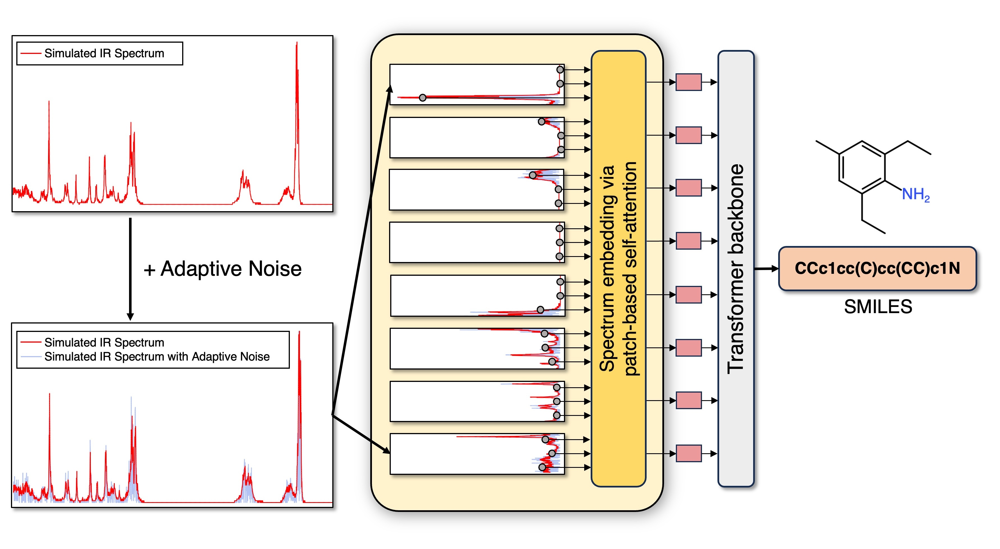

# Transformer-Based Models for Predicting Molecular Structures from Infrared Spectra Using Patch-Based Self-Attention

Scripts of paper: **Transformer-Based Models for Predicting Molecular Structures from Infrared Spectra Using Patch-Based Self-Attention**

### Abstract

Infrared (IR) spectroscopy, a type of vibrational spectroscopy, provides extensive molecular structure details and is a highly effective technique for chemists to determine molecular structures. However, analysing experimental spectra has always been challenging due to the specialised knowledge required and the variability of spectra under different experimental conditions. Here, we propose a Transformer-based model with a patch-based self-attention spectrum embedding layer, designed to prevent the loss of spectral information while maintaining simplicity and effectiveness. To further enhance the model’s understanding of IR spectra, we introduce a data augmentation approach, which selectively introduces vertical noise only at absorption peaks. Our approach not only achieves state-of-the-art performance on simulated datasets but also attains a top- 1 accuracy of 55% on real experimental spectra, surpassing the previous state-of-the-art by approximately 10%. Additionally, our model demonstrates proficiency in analysing intricate and variable fingerprint regions, effectively extracting critical structural information.



## Datasets

The original simulated infrared spectra datasets can be found at [Alberts dataset](https://zenodo.org/records/7928396) and [QM9S dataset](https://figshare.com/articles/dataset/QM9S_dataset/24235333). The experimental infrared spectra data is sourced from [NIST Chemistry WebBook](https://webbook.nist.gov/chemistry/).

## Experiments

### Environment

**Requirements**
```
python == 3.9.18
torch==2.0.1+cu118
torchtext==0.15.2
rdkit==2022.9.1
pandas=1.4.2
jcamp==1.2.2
scipy=1.7.3
tqdm==4.66.4
pyyaml=6.0.1
tensorboard==2.14.1
gputil==1.4.0
altair==5.1.2
scikit-learn==0.24.2
```
**Install via Conda**
```
# clone the environment
conda env create -f environment.yaml
# activate the environment
conda activate patchAttention
```


### Training
```
python ./code/train_main.py --para train_para.yaml
```

### Inference
```
python ./code/inference_main.py --para inference_para.yaml
```
### Checkpoints
Model checkpoints for three datasets can be found at 
[Zenodo](https://doi.org/10.5281/zenodo.12789777).